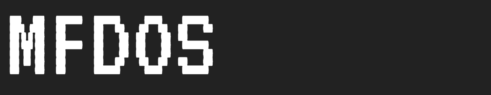

# Multiple Font Distributors Onboarding Summit

Font distributors all face similar issues with fonts delivered to them for distribution:
They need to validate these files, and compare them against previous/current releases.
Every foundry has their own set of tools to ensure that the fonts they publish are in a good condition. 

The Multiple Font Distributors Onboarding Summit (MFDOS) events bring together folks working at foundries and distributors to make all fonts better quality, and the lives of all foundries easier.

We discuss the onboarding challenges and opportunities that those of us at distributors face, and how we can collaborate on tools and workflows. 

## MFDOS 1: TypeCon 2018

The first MFDOS event is on Thursday August 2nd, 2018 in Portland, Oregon (just before the [TypeCon](https://www.typecon.org) conference) at the Google Portland offices. 

Spaces are limited, so contact <dcrossland@google.com> if you would like to attend in person. 

If you wish to dial in, a video conference will be offered via Google Hangouts.

## Background

[Font Bakery](https://GitHub.com/GoogleFonts/Fontbakery) is a new checking tool that comes with checks for OpenType, UFO, Glyphs and TFont files, at 3 levels: Format specifications, distributor requirements, and custom checks. 

The project was initiated by Dave Crossland in 2013 to accelerate the onboarding process for Google Fonts. 
In 2017 Lasse Fister rewrote it into a modern, modular architecture with a web [dashboard](https://GitHub.com/GoogleFonts/Fontbakery-Dashboard) suitable for both individuals and large distributors: 
A UI and a cloud system, to scale to checking 1,000s of files super fast in parallel using 1,000s of "container" virtual machines. (See his [TypoLabs 2018 talk on YouTube](https://www.youtube.com/watch?v=Kqhzg89zKYw).)

It now has an active community of contributors from foundries around the world, including Adobe Typekit, Dalton Maag, Google Fonts and Type Network.
